# Practica02---Mi-sitio-Web-CSS

 	
PRÁCTICA DE LABORATORIO
CARRERA: INGENIERIA DE SISTEMA/COMPUTACION	ASIGNATURA: HIPERMEDIAL
NRO. PRÁCTICA:	2	TÍTULO PRÁCTICA: Resolución de problemas sobre CSS3
OBJETIVO
•	Entender y organizar de una mejor manera los sitios de web en Internet
•	Diseñar adecuadamente elementos gráficos en sitios web en Internet.
•	Crear sitios web aplicando estándares actuales.

INSTRUCCIONES	
Con base a la Práctica 01 - Resolución de problemas sobre HTML5, se pide utilizar estilos CSS con la finalidad de obtener un diseño como el que se muestra a continuación.

 
Figura 1. Diseño base del sitio web

Para lo cuál, se recomienda utilizar, en al menos una página HTML, un diseño a dos columnas con cabecera y pie de página, como el que se muestra en la Figura 2. Así, como también se recomienda utilizar, en al menos una página HTML, un diseño a tres columnas con cabecera y pie de página como se muestra en la Figura 3.
 

Figura 2. Diseño de un sitio web con base a dos columnas

Figura 3. Diseño de un sitio web con base a tres columnas

De igual manera, se pide que se creé al menos tres archivos CSS, estos archivos estarán almacenados en una carpeta llamada css. Un archivo será para el diseño a dos columnas, otro archivo para el diseño a tres columnas, y los demás archivos será para la reglas CSS relacionas a textos, colores, tablas, secciones, artículos, etc.

También, se pide que se utilice selectores por etiquetas, selectores descendentes, selectores por clase y selectores por id.

Luego, se pide que se personalicen al menos tres etiquetas para títulos (h1 – h6), tanto en color, tamaño, fuente, decoraciones, etc.

Asimismo, se pide que se personalice todos los hipervínculos usando pseudo-clases.

También, se pide que se cree un menú vertical (navegación) para todas las páginas. El menú debe tener bordes ovalados, con color de fondo y una separación entre cada menú de al menos 5px.
 

	De igual manera, se pide crear una nueva página HTML, en donde, se muestre un formulario de contacto que tenga los siguientes campos (nombre, correo electrónico, mensaje y botón para enviar).

Asimismo, se pide que se utilice una gama de máximo cinco colores (ver más, https://htmlcolorcodes.com/es/recursos/mejor-paleta-de-colores-generadores/).

Finalmente, se pide que en toda la práctica existan al menos 50 reglas CSS.

No es permitido el uso de plantillas (CSS o HTML).

ACTIVIDADES POR DESARROLLAR
1.	Crear un repositorio en GitHub con el nombre “Practica02 – Mi Sitio Web (CSS)”

 

2.	Realizar un commit y push por cada requerimiento de los puntos antes descritos.
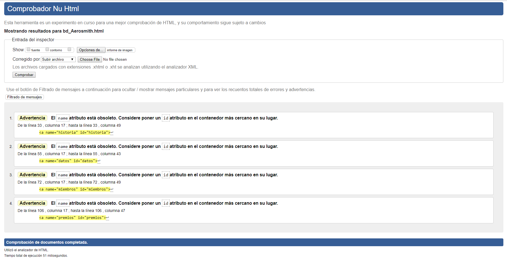
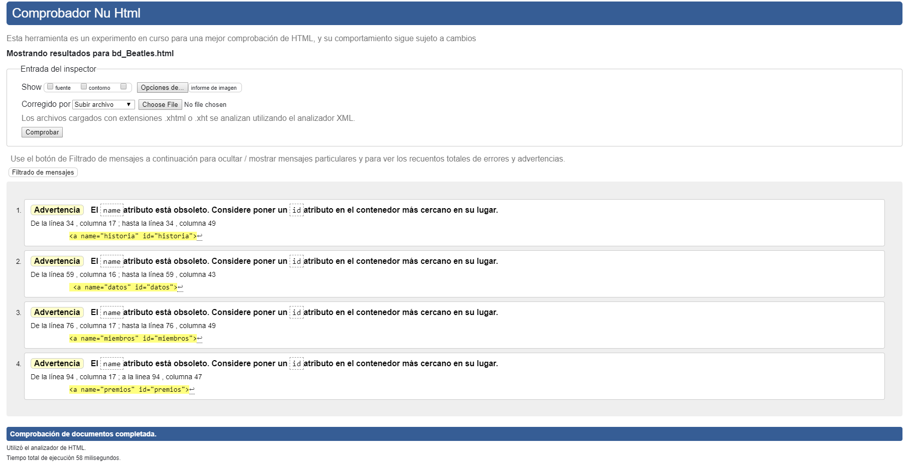
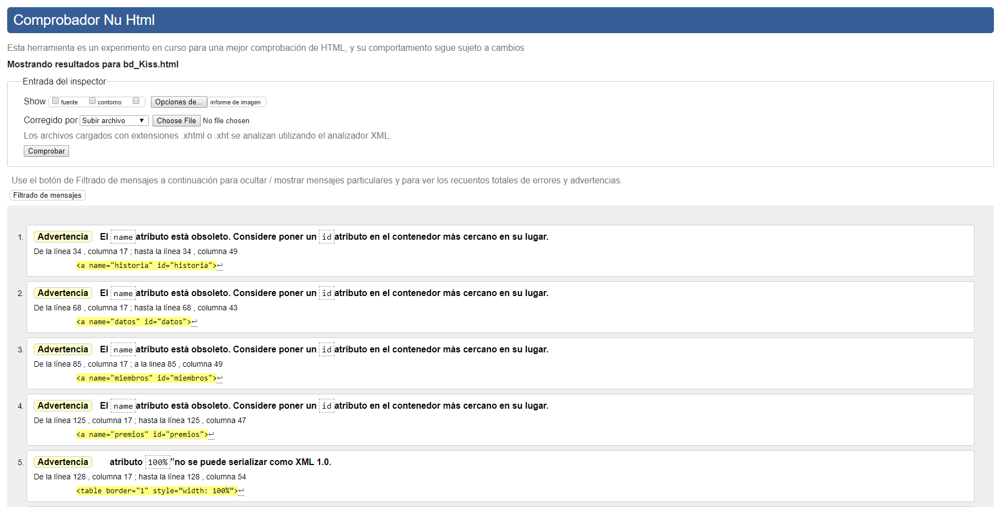
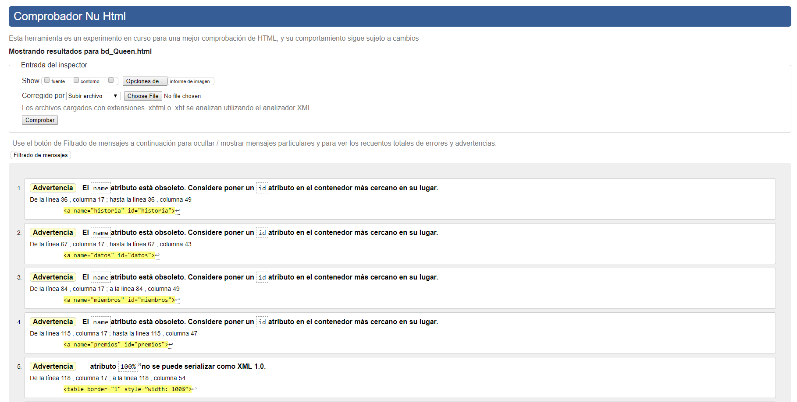

 

3.	Al finalizar la práctica se debe validar todas las páginas HTML y hojas de estilos CSS creadas usando el W3C Validator.

+

 

Bd-Beatles.html

 

Bd-Kiss.hmtl

 

Bd-Queen.html

 

4.	Luego, se debe crear el archivo README del repositorio de GitHub.

a.	Diseño de dos columnas
-	Estructura 
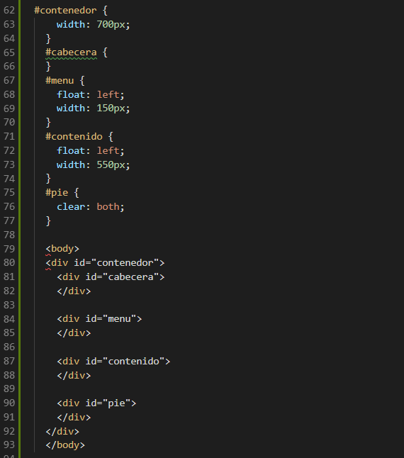

 
-	Código 

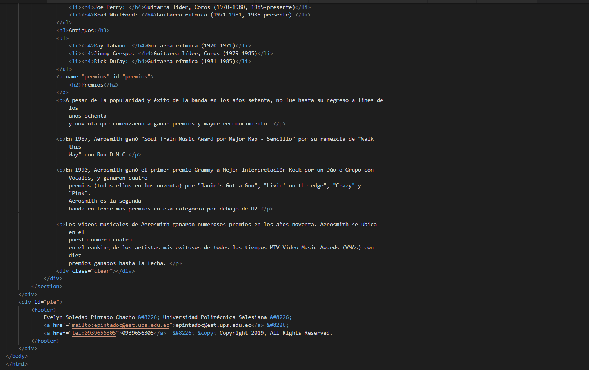

 

 

b.	Diseño de tres columnas
-	Estructura
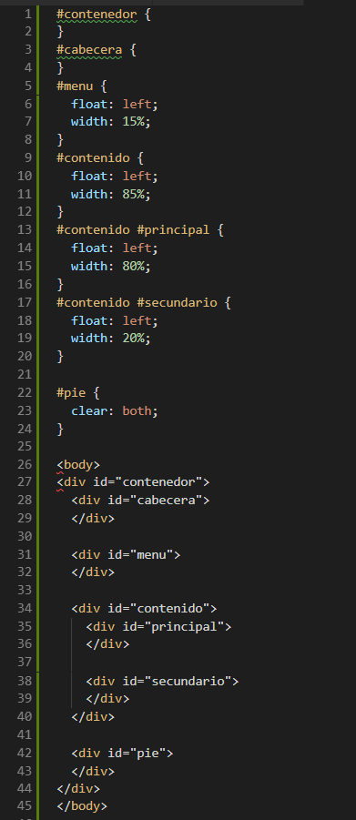

 
-	Código
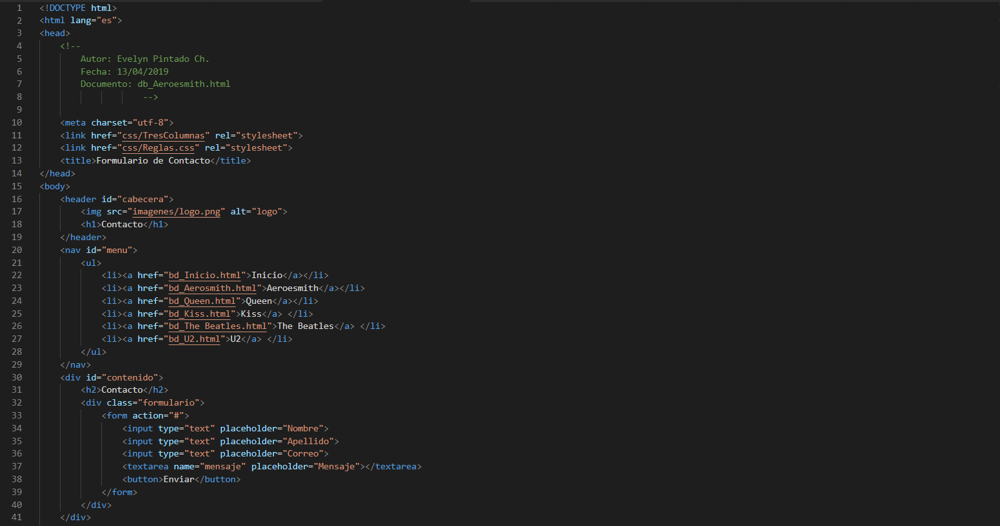
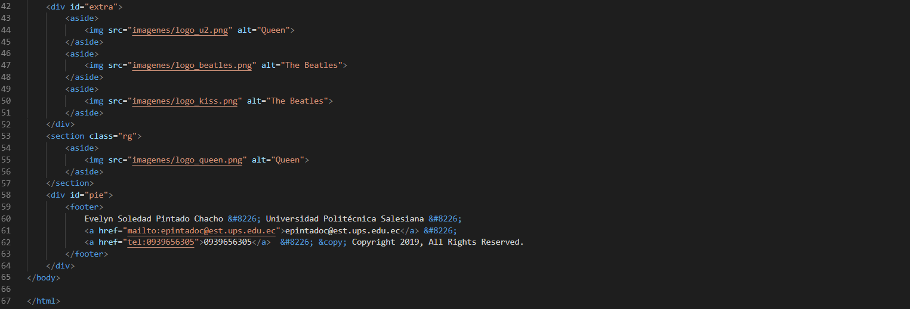

 

 

c.	Archivos externos de hojas de estilos
-	Las páginas html llaman a un archivo externo de hoja de estilos CSS.
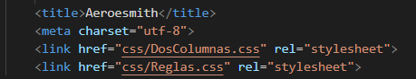
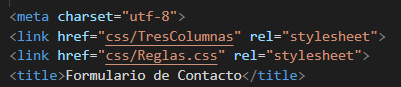

 

 
-	Todos los archivos CSS se encuentran organizados en una sola carpeta.
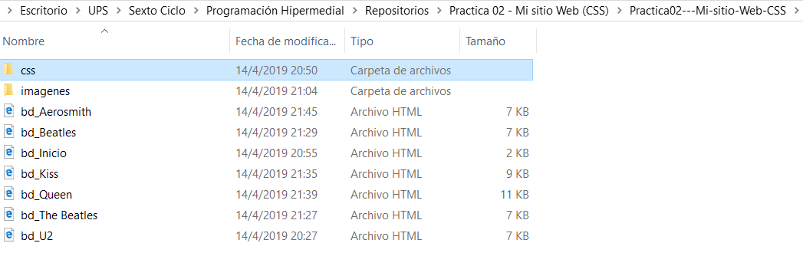
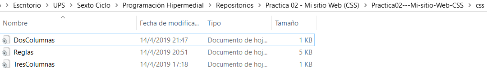

 

 

d.	Uso de selectores
-	Etiqueta                                                                  -    De Clase
                                                                                          
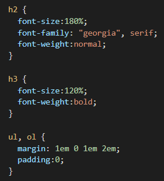
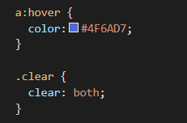

                                                                                    

                                                                                    

 
-	Id                                                                            -    Descendiente
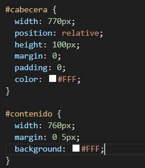
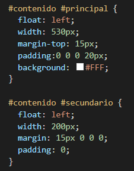

                                                                                    
 

e.	Personalización de etiquetas
-	A continuación se presenta la estructura utilizada donde se emplea desde h1 hasta h4.
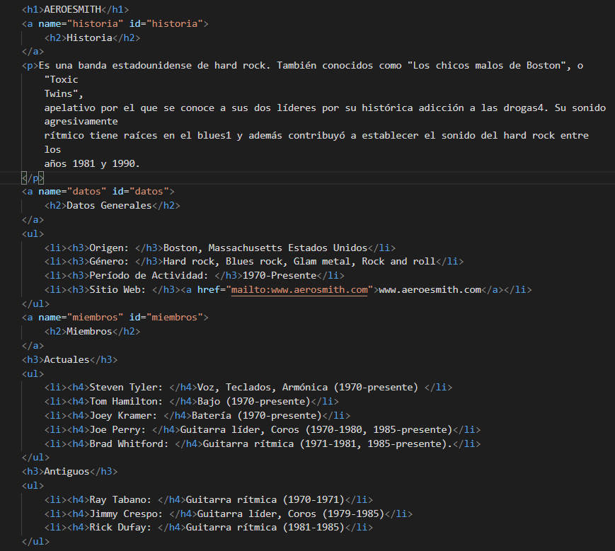

 

f.	Validación de practica
-	La validación de la página de encuentra en el punto 3 del informe.

g.	GitHub
-	La realización de los commits y los cambios realizados en el repositorio se encuentra en el punto numero 2 del informe de la práctica.
h.	Informe 
-	El informe se encuentra en formato PDF, con el nombre y firma del estudiante.
Usuario: EvelynPintado23
URL: https://github.com/EvelynPintado23/Practica02---Mi-sitio-Web-CSS.git 

6.	En el archivo README del repositorio debe constar la misma información del informe de resultados de la práctica que se indica en el punto anterior.

RESULTADO(S) OBTENIDO(S):
•	Tener el conocimiento suficiente para que el estudiante pueda entender y organizar de una mejor manera los sitios de web y de negocios en Internet
CONCLUSIONES:
•	Los estudiantes podrán organizar sitios web basados en el lenguaje de etiquetado HTML y CSS
•	Obtener y reforzar los conocimientos sobre este lenguaje.
•	Adquirir más experiencia en el lenguaje de etiquetas
•	Obtener información y familiarizarse con este lenguaje en la creación de tablas e inserción de videos.
RECOMENDACIONES:
•	Probar la solución de la práctica en al menos tres navegadores web; Google Chrome, Firefox y Safari
•	Buscar información sobre las etiquetas que no sabemos cómo utilizar.
•	Insertar imágenes y videos de acuerdo a los temas.
•	Tener en cuenta que este es un lenguaje secuencial.

Estudiante:   Evelyn Pintado Ch.
Firma:  

